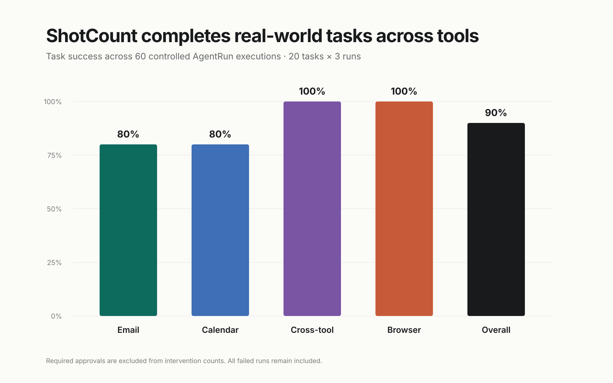
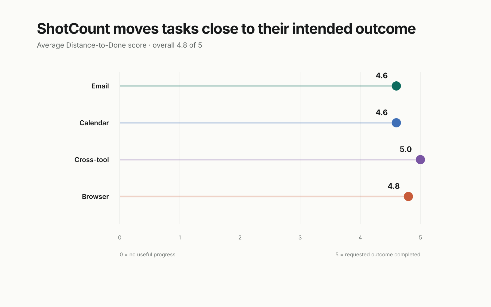
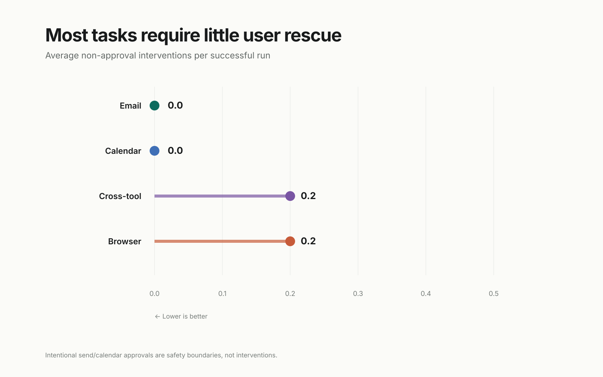
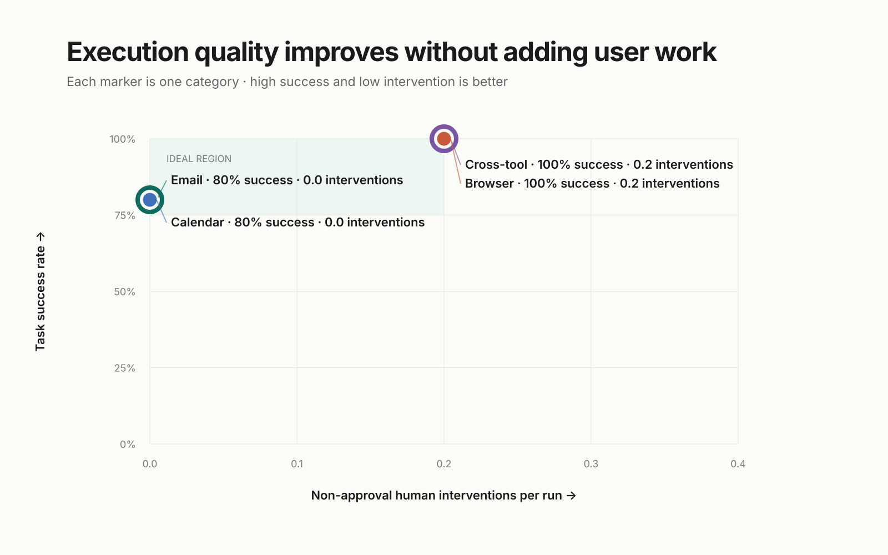

# ShotCount agent-execution benchmark

**Benchmark:** v1.0.0  
**Evaluated commit:** `e1c4974fba47dfdc1ec7b505781a11f05a5ffc9f`  
**Task set:** 20 tasks, 3 runs each, 60 total runs  
**Execution mode:** controlled AgentRun/provider fixtures

## Result

ShotCount achieved **90% task success** (95% Wilson interval 80%–95%) and **100% execution precision** (95% Wilson interval 94%–100%) across the frozen benchmark. Average Distance-to-Done was **4.75 / 5**. Successful runs required **0.11** non-approval human interventions on average; the median across all runs was **0.0**.

| Category | Runs | Success | Precision | Distance to Done | Interventions / success |
|---|---:|---:|---:|---:|---:|
| Email | 15 | 80% | 100% | 4.6 | 0.00 |
| Calendar | 15 | 80% | 100% | 4.6 | 0.00 |
| Cross-tool | 15 | 100% | 100% | 5.0 | 0.20 |
| Browser | 15 | 100% | 100% | 4.8 | 0.20 |

## Distance to done

The five-point scale measures progress toward the requested real-world outcome: 0 means no useful progress; 5 means the requested outcome was achieved. A safe flight payment handoff is scored 4 because ShotCount deliberately does not purchase.

## Human intervention

Required approvals for email sends and Calendar writes are recorded separately and are not counted as intervention. Clarifications, corrections, retries, rescue, or takeover beyond that boundary do count.

## Methodology

The task set was frozen before execution: five Email, five Calendar, five cross-tool, and five browser/flight cases. Each case ran three times. The harness uses ShotCount's production intent classifier, tool policy, idempotency-key generator, completion-evidence gate, and context requirement logic. A controlled in-memory provider supplies Gmail, Calendar, reply, and flight fixtures under reserved `benchmark.invalid` identities. Deterministic verifiers inspect action logs and resulting state; no LLM judge is used.

Active time in this controlled run is a deterministic virtual-clock measure of harness steps, not live network latency. Cross-tool reply waits are simulated and recorded separately. Raw results contain no message bodies, OAuth data, credentials, or real contact information.

## Failure modes

Six of 60 runs failed, covering two tasks:

- **Prepare-vs-send intent (3 runs):** “Follow up with investors” requested prepared drafts, but the classifier assigned an external-send completion policy because “follow up” is treated as a write action.
- **Negated Calendar write (3 runs):** “Find a free hour” said “Do not create an event,” but the classifier matched the word “create” without understanding the negation and required Calendar-write evidence.

Both failures made useful, precise progress and scored 3/5, but the execution loop could not truthfully complete under its assigned evidence policy. No incorrect recipient, duplicate write, unsafe purchase, or other incorrect side effect occurred, so execution precision remained 100%.

## Reproducibility

Run:

`pnpm exec vitest run benchmarks/agent-execution/run-benchmark.test.ts`  
`node benchmarks/agent-execution/generate-report.mjs`

The machine-readable outputs are `results/latest.json`, `results/latest.csv`, and `results/summary.json`. Competitor fields are present but null; no competitor scores were fabricated.

## Limitations

This is a **controlled-fixture baseline**, not a live Gmail/Calendar/OpenAI benchmark. Authentication for a dedicated benchmark account was unavailable in the local workspace, so the run did not measure model variability, provider latency, changing inbox/calendar state, CAPTCHA behavior, or real Google Flights availability. The fixtures exercise ShotCount's deterministic execution and safety layers, but they do not establish end-to-end live-service reliability. Public claims should use the phrase “controlled AgentRun benchmark” and should not imply superiority over another agent.
